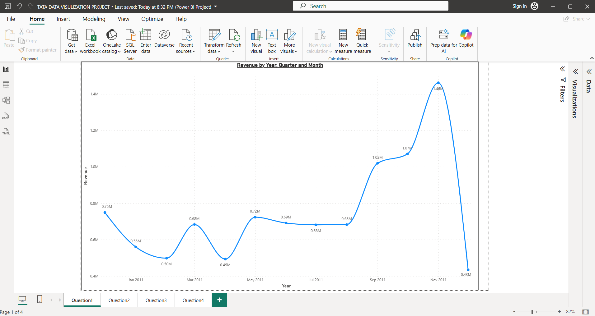
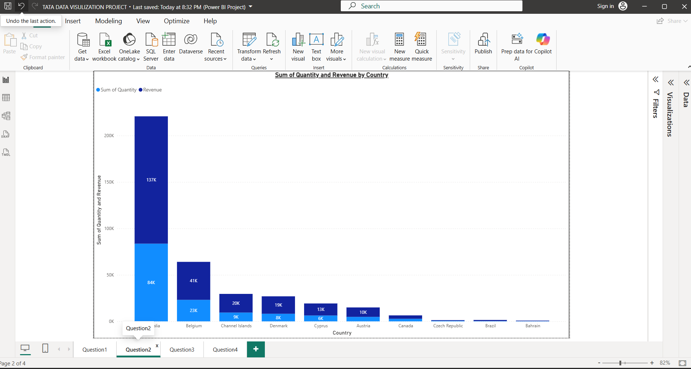
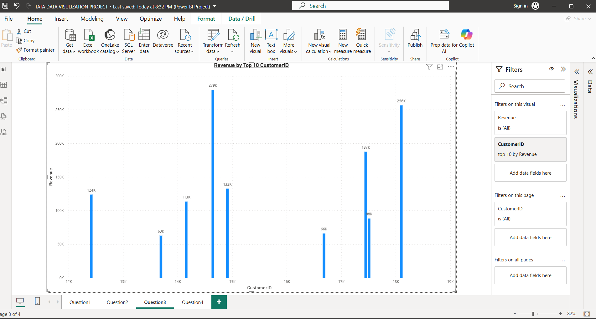
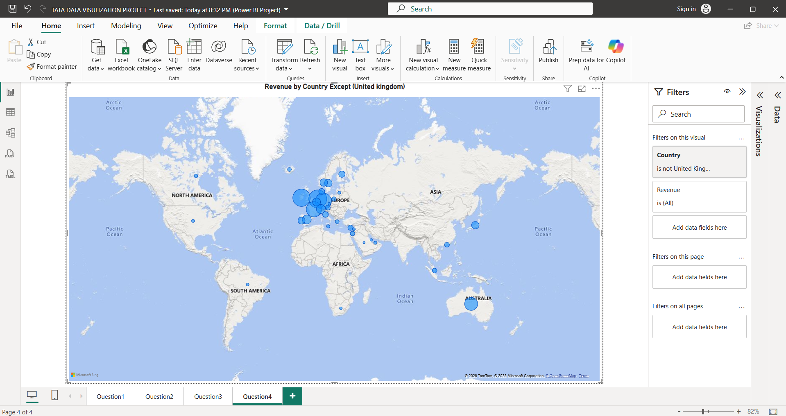

# Project 6 - TATA Data Visualization

## Overview

This project is an interactive Power BI dashboard developed as part of a TATA data visualization project.

The dashboard presents business data through interactive visualizations, KPIs, charts, and analytical views to identify important trends, patterns, and business insights.

---

## Key Features

* Interactive data visualization
* Business KPI analysis
* Data exploration
* Trend analysis
* Category-based analysis
* Interactive filters and slicers
* Power BI visualizations
* DAX measures
* Power Query
* Data modeling
* Business insights and reporting

---

## Dashboard Preview

### TATA Data Visualization Dashboard

**Dashboard Overview:**  
This dashboard provides a clear overview of the TATA data visualization project.  
It presents important business metrics and visualizations for understanding overall performance.  
Interactive elements allow users to explore different categories and sections of the data.  
The dashboard helps identify trends, patterns, and relationships within the dataset.  
These visualizations support clear and data-driven business analysis.

### TATA Data Analysis

**Data Analysis:**  
This view provides a detailed analysis of the business data across different dimensions.  
It helps compare important categories, trends, and performance metrics within the dataset.  
Users can explore relationships between different data fields using interactive visuals.  
The charts make complex information easier to interpret and compare.  
The analysis supports the identification of meaningful business patterns.

### Detailed TATA Insights

**Detailed Analysis:**  
This view presents additional insights from the TATA dataset.  
It helps examine important business patterns and variations across multiple dimensions.  
The combination of visualizations provides a deeper understanding of the analyzed data.  
Interactive filtering makes it easier to focus on specific areas of interest.  
These insights can support informed business analysis and decision-making.

### Additional Visualization

**Additional Insights:**  
This view provides another perspective of the TATA data visualization analysis.  
It highlights additional metrics, trends, and relationships within the dataset.  
Users can use the visual elements to compare different business dimensions.  
The dashboard makes detailed information easier to understand and explore.  
These insights further support data-driven analysis and reporting.

---

## Tools & Technologies

* Power BI
* DAX
* Power Query
* Data Modeling
* Data Visualization

---

## How to Open

1. Clone this repository to your local machine.
2. Open TATA DATA VISULIZATION PROJECT.pbip using Power BI Desktop.
3. Refresh the data if required.
4. Explore the interactive dashboard.

---

## Project Objective

The objective of this project is to transform business data into meaningful visual insights using Power BI and provide an interactive analytical experience for understanding trends, patterns, and business performance.
